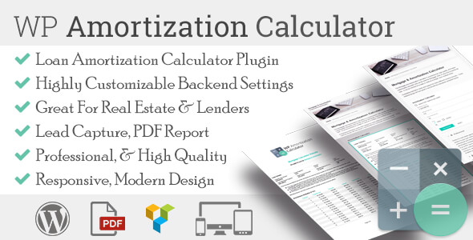
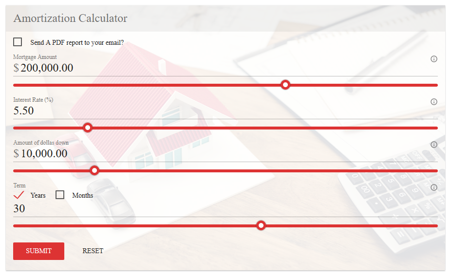
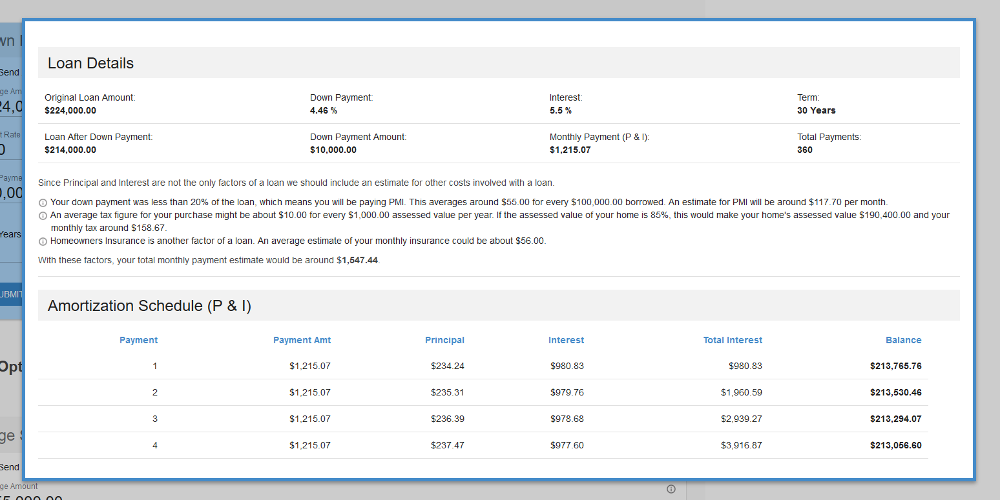
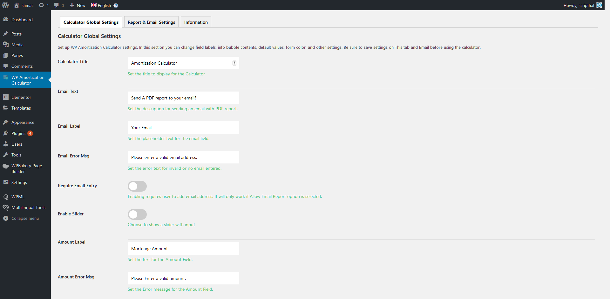
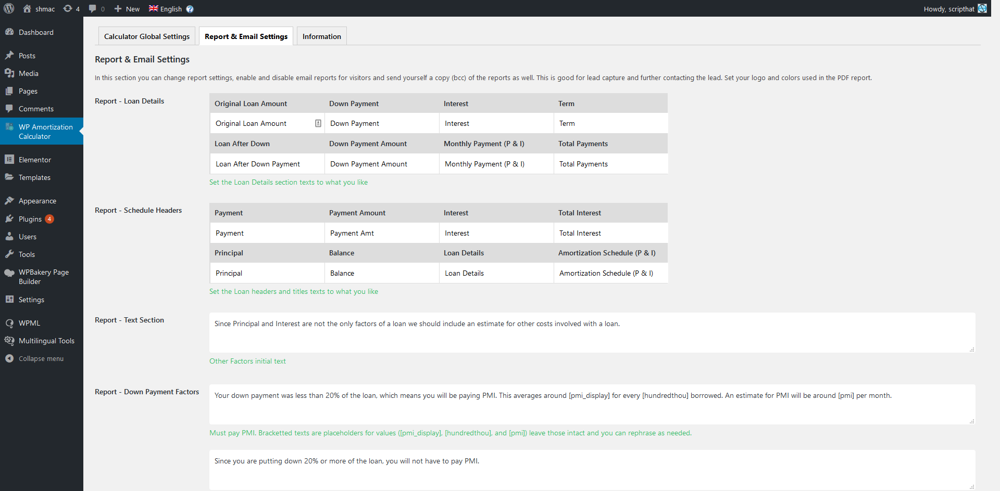

# WP Amortization Calculator

---

### Description

WP Amortization Calculator is a responsive WordPress plugin that lets you display an Amortization 
Calculator to visitors and gives them a detailed Amortization schedule along
with payment information.  Users can also choose to receive a pdf copy of
their results (and you can choose to receive a copy of it for lead generation).  The WP Amortization 
Calculator has highly customizable features so that it blends in well with
your theme!

#### Below are some examples of what the calculator can look like:

#### Example Report:

---

### Installation

Installing "WP Amortization Calculator" can be done by using the following steps:
-  Download the plugin after purchase
-  Upload the ZIP file (shmac.zip) through the 'Plugins > Add New > Upload' screen in your WordPress dashboard
-  Activate the plugin through the 'Plugins' menu in WordPress

#### Be sure to save the backend settings before using for both the Global settings and Report & Email settings

---

### Frequently Asked Questions

#### What does this plugin do?
This plugin generates mortgage amortization schedules and details for visitors
to your WordPress website and can be used as a widget or as a shortcode.
Users can choose to receive a pdf copy of the amortization schedule which you 
can also be bcc'd on as a lead generator. 
Full Documentation is located at https://www.scripthat.com/wpamortize

#### I'm not receiving an email report when running the amortization calculator.

Probably the biggest issue we hear…this can be for all sorts of reasons like your WordPress email functionality working correctly, your server being configured to deliver mail all the way to the client rejecting your domain’s email address.  Here are some things to help you troubleshoot:

Email can be a tricky thing as the receiving end can also be blocking or putting it in a spam folder…As long as WordPress can send mail, the calculator should be able to also, here’s a few things to try:

1.  Is your site able to send email through WordPress, since the
amortization calculator uses WordPress mail functions that needs to be
operational. There are plugins that let you test if you aren’t sure
here’s one https://wordpress.org/support/plugin/check-email
2.  The ‘from’ email address needs to be allowed by your server. A lot
of times hosting companies will block from addresses that are not the
same origin as the domain so you should test with an email address from
your domain.

3.  Check the receiving end’s junk / spam folder to make sure you haven’t already received it.

4.  Mail from your domain might be blocked by the receiving end email.  Try testing with a different receiving email to test.

#### PDF Email works with smaller loan terms but not larger ones (e.g. works with 15 years but not 30)

This problem is indicative of PHP memory limits affecting the ability to dynamically generate the pdf.  The PDF is dynamically generated and needs memory to do so. the more amount of entries the more memory it needs.  You will need to increase the PHP memory limit set by your server or have your hosting company help you do so to correct this.  The PHP setting to change for this is:

`memory_limit = 128M`

---

### Changelog

1.5.6
- 2022-12-13
- Updates to code for php v8.1
- Wordpress 6.1.1 support

1.5.5 
- 2020-06-18
- Fix for Term output not being overriden by Visual Composer element

1.5.4
- 2020-06-17
- Added overrides for Visual Composer element to override all text per calculator

1.5.3 
- 2020-05-28
- Fix for some styling issues
- Added output filtering capability for overrides

1.5.2 
- 2020-04-20
- Fix for php version 7.1 with Elementor comma placement error
- Fix for down payment show and pdf report not displaying down payment info

1.5.1
- 2020-04-11
- Many improvements, style enhancements, fixes
- Elementor integration
- WPML integration
- Indian and Swiss number formats added
- File size and loading optimization
- Calculator background images and color added
- All output text set in backend settings 
- Be sure to save settings if upgrading from older versions!
- Output results to Modal and now below calculator

1.4.5 
- 2019-12-12
- Updated automatic updates to use Envato Market plugin

1.4.4
- 2019-04-30
- Updated translation files for string locations

1.4.3 
- 2019-02-04
- Added Chinese font compatability for PDF Generation.

1.4.2 
- 2018-12-22
- Updated TCPDF to latest version 6.2.25 to fix some warnings in php 7.3

1.4.1
- 2018-11-27
- Added option to use checkbox or always show email input. It will only work if Allow Email Report Option is selected yes.

1.4
- 2018-07-24
- Added option to hide/show Down Payment from Form and results.

1.3
- 2018-06-24
- Fixed Bug and added ROI EU decimal system.

1.2
- 2017-12-04
- As Many Users Request/Demand
- Added Option of whether to show month or year or both as Term Type.

1.1.11
- 2017-09-17
- Fixed the float value issue.

1.1.10
- 2017-05-29
- Added hierarchy in frontend.css file.

1.1.9
- 2017-04-18
- Added Sliders theme and  js/css minify options

1.1.8
- 2017-04-7
- Added Sliders to calculator as a choice for input options

1.1.7
- 2017-02-22
- Fix for loading scripts only when shortcode is in use

1.1.6 
- 2016-10-24
- Added RTL support and added some different font types for PDF generation

1.1.5 
- 2016-2-25
- Added choice of amount or percent for down payment option
- Reset mail content type after send to avoid conflicts - https://core.trac.wordpress.org/ticket/23578

1.1.4
- 2015-12-3
- Added choice of percent of loan amount for insurance estimates
- Added css unique class names for form entry fields
- Small fix for plugin check if installed already
- Correction for PMI Override

1.1.3
- 2015-10-8
- Removed redundant titles
- Fixed pdf to outlook unformatted message

1.1.2 
- 2015-10-5
- Replaced svg with png (some systems don't support svg)
- Changed same function call that conflicted with another plugin
- A couple style fixes

1.1.1
- 2015-09-29
- Fixed progress bar association for multiple calculators
- Added per calculator overrides for all settings
- Visual Composer integration
- Max 50 years set for amortization

1.1.0 
- 2015-09-26
- Initial release

